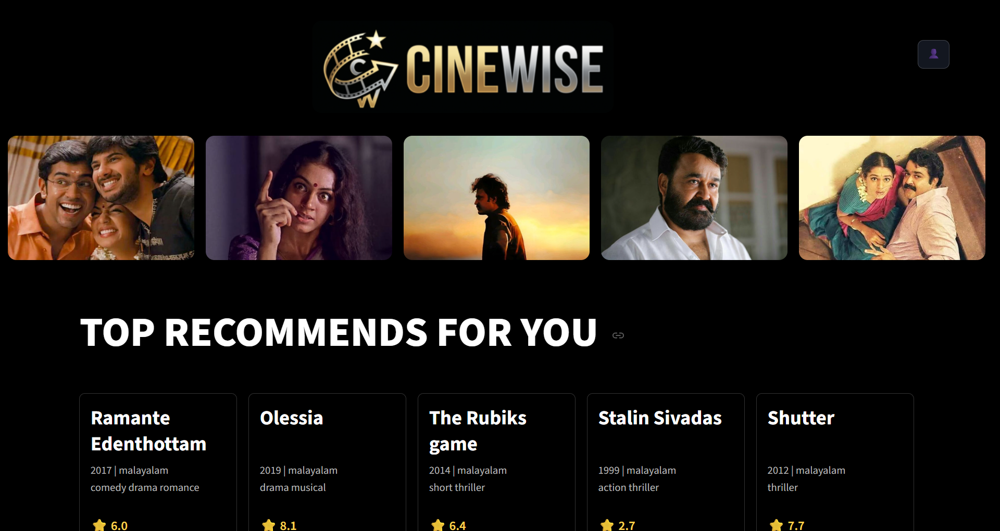
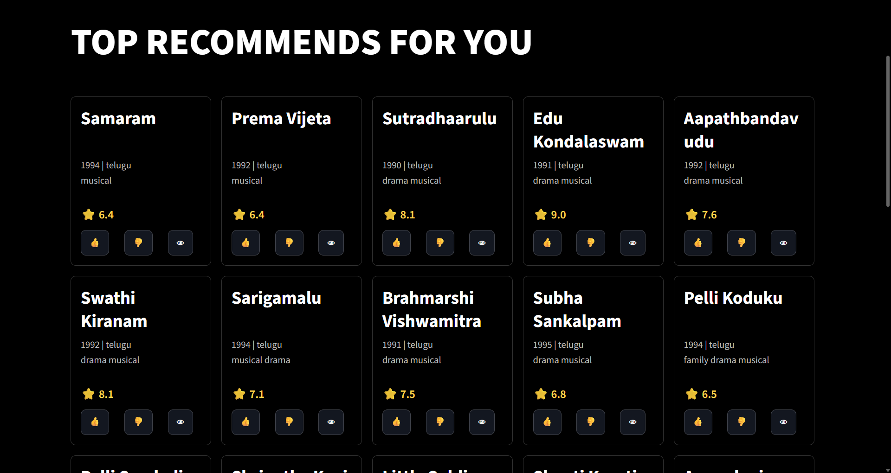
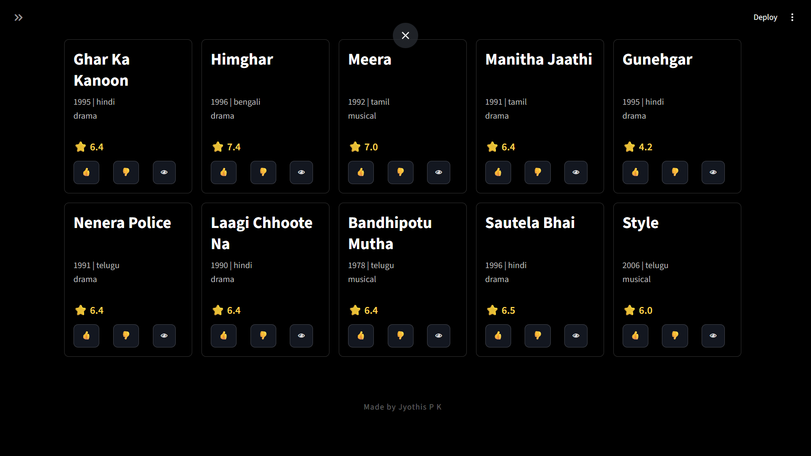
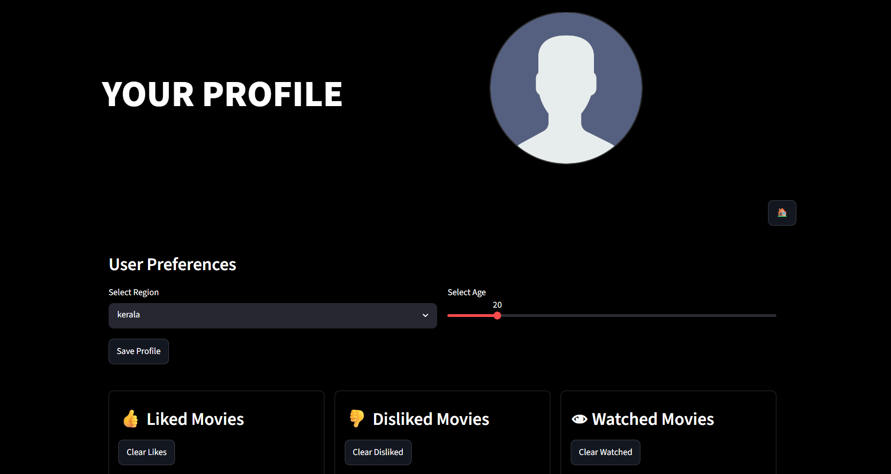
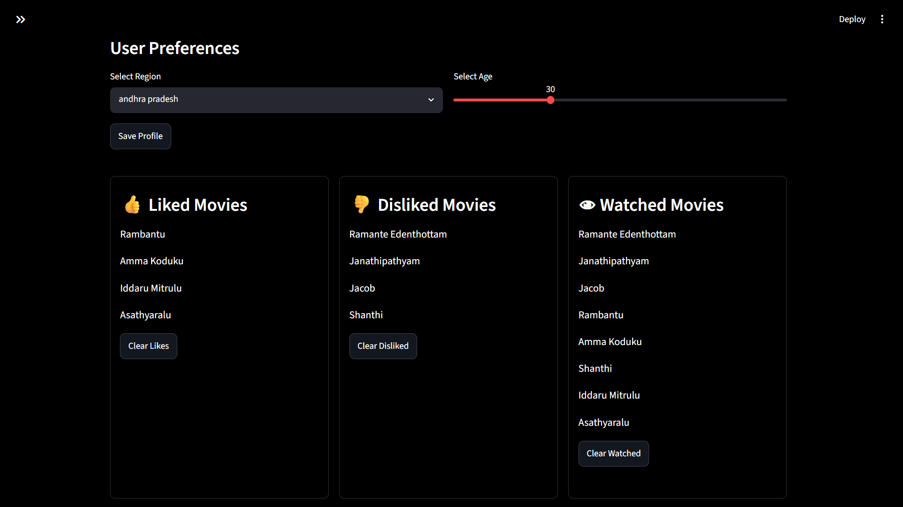

<h1 align="center">
  🎬 CineWise 🎬
</h1>

<p align="center">
  <b>Phase 2</b>
</p>

**Live Demo:** 

<h3 align="center">
  Hybrid Context-Aware Indian OTT Recommendation System
</h3>

CineWise is a hybrid movie recommendation system focused on Indian OTT content.  
The project combines **content-based filtering** with **context-aware recommendation logic** to provide personalized movie suggestions based on user interactions and user profile preferences.

Unlike traditional OTT recommenders that rely only on watch history, CineWise dynamically adapts recommendations using:

- User liked movies
- Disliked movies
- Watched history
- Regional preferences
- Age-based viewing patterns
- Era-based movie preferences

The system is designed as an interactive OTT-style recommendation platform built using **Python** and **Streamlit**.

---

# 🚀 Preview



---

# 🚀 Features

- 🎯 Hybrid Recommendation System
- 👍 Like / 👎 Dislike / 👁 Watch interaction tracking
- 🌍 Region-aware recommendations
- 🎭 Age-based genre adaptation
- 🕰 Era-aware movie recommendations
- 🧠 Dynamic recommendation scoring
- 📊 Context-aware reranking
- 🎬 OTT-style dark themed UI
- 🔄 Real-time recommendation updates

---

# 🧠 Recommendation Methodology

CineWise uses a **hybrid recommendation architecture** combining:

## 1. Content-Based Recommendation

Movies are vectorized using:

- Genre
- Language
- Era

using:

```python
CountVectorizer()
```

Cosine similarity is then used to measure similarity between watched movies and unseen movies.

### Interaction Signals

The system maintains three interaction lists:

- Liked Movies
- Disliked Movies
- Watched Movies

Recommendation scores are dynamically computed using:

- Similarity to liked movies
- Similarity to watched movies
- Penalty for disliked similarity

---

## 2. Dynamic Penalty System

A divergence-based penalty mechanism is used to suppress movies similar to disliked content.

The system calculates similarity divergence between:

- liked movie vectors
- disliked movie vectors

using:

```python
Jensen-Shannon Divergence
```

This helps the recommender estimate how strongly user dislikes should affect future recommendations.

---

## 3. Context-Based Recommendation

The system additionally applies contextual reranking using:

### 🌍 Region Preference

Movies matching the user's regional language receive additional weight.

### 🎭 Age-Based Genre Preference

Different age groups prioritize different genres.

### 🕰 Era-Based Recommendation

Movies are reranked according to preferred movie eras for each age group.

---

## 4. Hybrid Recommendation Fusion

Final recommendations are generated by combining:

- Content-based recommendation score
- Context-based recommendation score

The recommendation system gradually shifts from context-based recommendations to behavior-based recommendations as user interactions increase.

---

# 🖥 User Interface

CineWise uses a modern OTT-inspired interface built using Streamlit.

### UI Features

- Dark themed interface
- Dynamic movie recommendation rows
- Interactive movie cards
- Like / Dislike / Watch buttons
- User profile page
- Real-time recommendation updates

---

# 🛠 Technologies Used

- Python
- Streamlit
- Pandas
- NumPy
- Scikit-learn
- SciPy

---

# 📂 Project Structure

```text
CineWise/
│
├── app.py
├── data/
│   ├── more cleaned movies.csv
│   └── user_data.json
│
├── images/
│
├── src/
│   ├── ContentBased.py
│   ├── ContextBased.py
│   └── mapping.py
│
└── pages/
    └── profile.py
```

---

# 📸 Screenshots

## 🏠 Home Page

<p align="center">
  
  
</p>

---

## 👤 Profile Page

<p align="center">
  
  
</p>

---

# 🔮 Future Improvements

- Movie poster integration using external APIs
- Real-time user authentication
- Recommendation explainability system

---

# 📌 Key Learning Outcomes

This project helped in understanding:

- Recommendation system architecture
- Hybrid recommendation techniques
- Content-based filtering
- Vectorization and cosine similarity
- Context-aware recommendation logic
- User interaction modeling
- UI integration using Streamlit

---

# 👨‍💻 Developed By

### Jyothis P K

Data Science & Recommendation Systems Enthusiast

B.Tech Computer Science and Engineering  
APJ Abdul Kalam Technological University (KTU)
